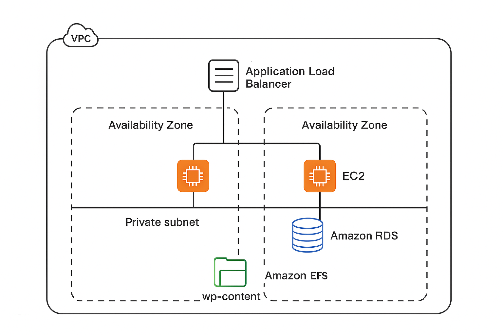

# Projeto: WordPress de Alta Disponibilidade na AWS

## 1. Visão Geral
Este projeto documenta a implementação de uma arquitetura **WordPress** na nuvem **AWS**, projetada para ser **altamente disponível, escalável e resiliente**.  
Utilizando uma abordagem de **contentores com Docker** e os principais serviços gerenciados da AWS, a infraestrutura simula um ambiente de produção real, capaz de suportar falhas de componentes sem indisponibilidade e escalar dinamicamente de acordo com a demanda.

---

## 2. Arquitetura da Solução
A solução segue um design **multi-tier** (múltiplos níveis) para garantir segurança e desacoplamento entre os componentes.

- **Ponto de Entrada (ALB)**: Um *Application Load Balancer (ALB)* público serve como o único ponto de entrada para todo o tráfego dos utilizadores.  
  - Distribuído em **2 Zonas de Disponibilidade (AZs)**.  
  - Encaminha requisições apenas para instâncias saudáveis.  

- **Camada de Aplicação (EC2 & ASG)**:  
  - O WordPress é executado em contentores Docker dentro de **instâncias EC2**.  
  - As instâncias são geridas por um **Auto Scaling Group (ASG)** com 2 instâncias mínimas em **sub-redes privadas**, garantindo isolamento da internet.  

- **Camada de Dados (RDS)**:  
  - Banco de dados **MySQL no Amazon RDS** em sub-redes privadas.  
  - Apenas a camada de aplicação pode se conectar a ele.  

- **Camada de Armazenamento de Ficheiros (EFS)**:  
  - O diretório `wp-content` é montado no **Amazon EFS**.  
  - Todos os contentores WordPress compartilham o mesmo estado.  

- **Segurança e Acesso**:  
  - Segmentação em **sub-redes públicas e privadas**.  
  - **Security Groups** controlam tráfego entre componentes.  
  - **Bastion Host** garante acesso administrativo seguro às instâncias privadas.  

### Diagrama da Arquitetura


---

## 3. Implementação e Configuração Detalhada

### 3.1. Rede (VPC)
- Criada uma VPC customizada com o assistente **“VPC e mais”**.  
- **2 AZs** para alta disponibilidade.  
- **Sub-redes**:  
  - 2 públicas (ALB + Bastion Host).  
  - 2 privadas (EC2 + RDS).  
- **Gateways**:  
  - **Internet Gateway** → acesso para sub-redes públicas.  
  - **NAT Gateway** → acesso à internet para recursos privados.  

### 3.2. Imagem do Servidor (AMI) e Automação
- Criada AMI customizada a partir do **Amazon Linux 2023**.  
- Instalação de **Docker e Docker Compose**.  
- Criado arquivo `docker-compose.yml` seguro, com credenciais lidas de **variáveis de ambiente** (sem exposição de senhas).  

### 3.3. Launch Template e User Data
Configurado um **Launch Template** com:  
- AMI customizada.  
- Instância **t2.micro**.  
- **Security Group**: `wordpress-ec2-sg`.  
- **Perfil IAM**: `EC2-WordPress-Role` (acesso ao Secrets Manager).  
- **User Data Script**:  
  - Busca senha no **AWS Secrets Manager**.  
  - Monta **EFS**.  
  - Exporta credenciais como variáveis de ambiente.  
  - Executa `docker compose up -d`.  

### 3.4. Auto Scaling Group (ASG)
- Baseado no Launch Template.  
- Capacidade mínima/desejada: **2 instâncias**.  
- Capacidade máxima: **4 instâncias**.  
- Política de escalonamento: **CPU média 50%**.  

### 3.5. Application Load Balancer (ALB)
- Posicionado em **sub-redes públicas**.  
- Criado Target Group `wordpress-tg` com **health check** customizado (`200` e `302`).  
- Integrado ao ASG para registro/deregistro automático das instâncias.  

---

## 4. Atividades Extras

### 4.1. Monitorização com CloudWatch
Criado dashboard `wordpress-dashboard` no **Amazon CloudWatch** com:  
- CPU média do ASG.  
- Contagem de requisições no ALB.  
- Conexões do banco de dados RDS.  

### 4.2. Teste de Escalabilidade
- Executado **teste de carga** para validar política do ASG.  
- Utilizado **Bastion Host** para simular carga.  
- O ASG escalou para uma 3ª instância durante o teste e reduziu automaticamente após.  

---

## 5. Ambiente de Desenvolvimento Local
Para executar o projeto localmente:

1. Crie um arquivo **`.env`** com:  
   ```env
   MYSQL_PASSWORD=SUA_SENHA_FORTE_AQUI
